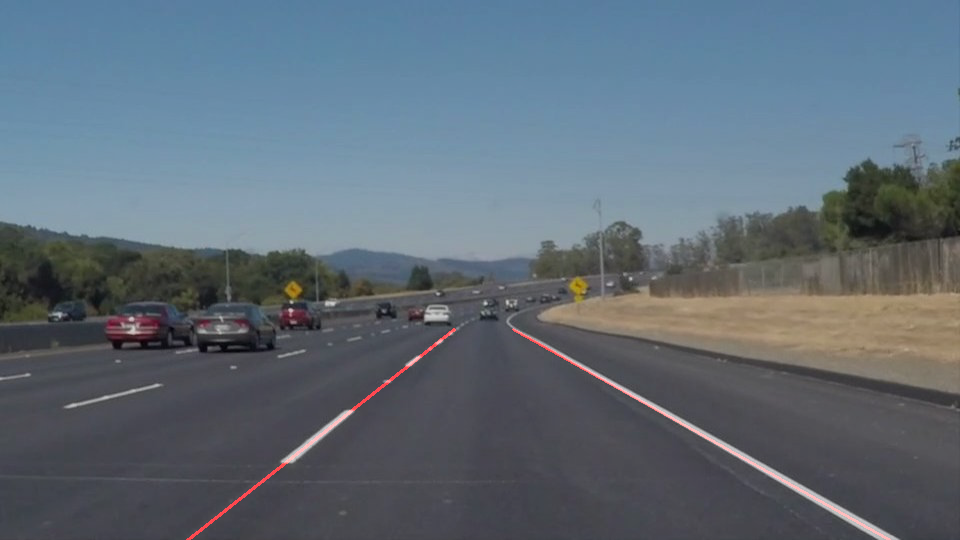
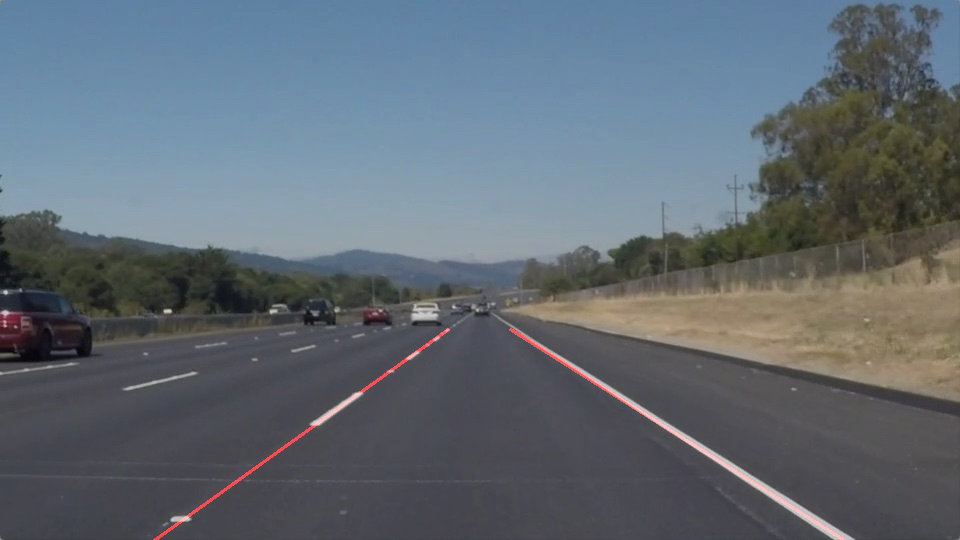
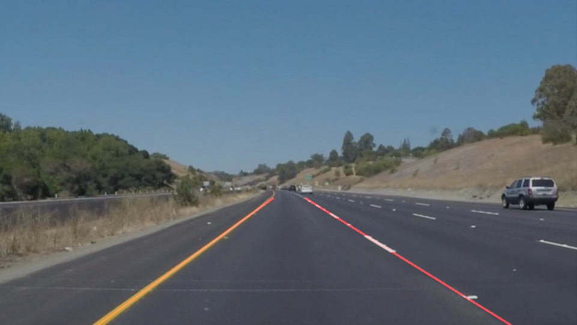
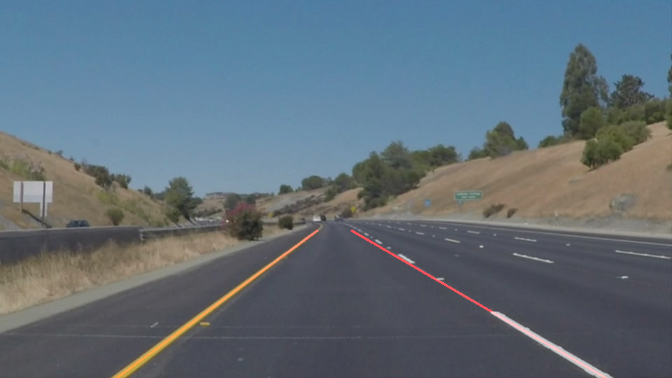
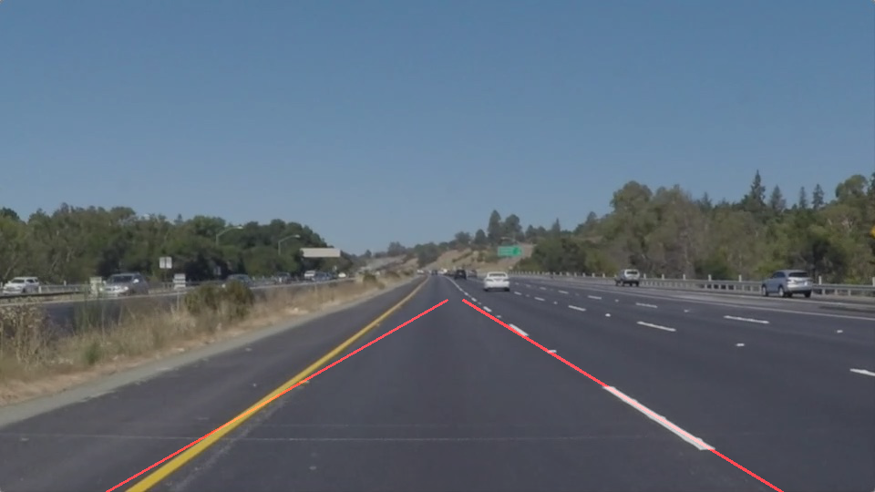
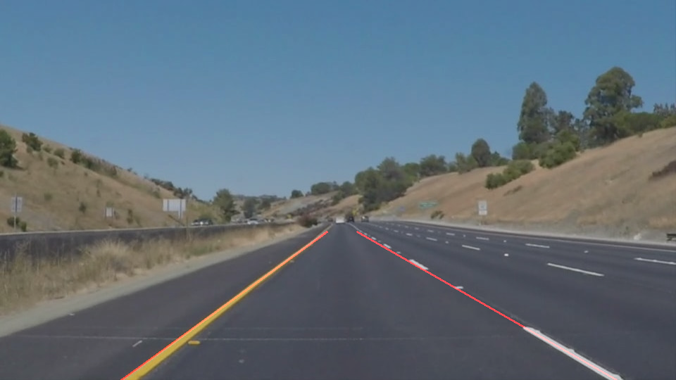

# **Finding Lane Lines on the Road** 

## Writeup Template

### You can use this file as a template for your writeup if you want to submit it as a markdown file. But feel free to use some other method and submit a pdf if you prefer.

---

**Finding Lane Lines on the Road**

The goals / steps of this project are the following:
* Make a pipeline that finds lane lines on the road
* Reflect on your work in a written report

---

### Reflection

### 1. Describe your pipeline. As part of the description, explain how you modified the draw_lines() function.

My pipeline consisted of 6 steps. I chain them using python functools reduce function and partial function.

Firstly, I converted the images to grayscale,

Secondly, I use gaussian_blur to to smooth the image from the previous grey scale image. 

Thirdly, I use Canny Edge detection filter to detect edges in image.

Fourthly, I apply a polygon mask on image to get interested region, the region I set is a Trapezoidal, with the lower bound of image and upperbound as (450, 330), (490, 330).

Fifthly, I extrapolate and draw the lines . I first calculate the slope using hough transform. Then I seperate them into two sets by using its negativity. I refer to slack chanel Sashank Aryal's suggestion to filter those have absolute value less than 0.3. Later on I use numpy polyfit to compute slope and intersection to the axis and return the lines we get

Finally, draw the line on the input image

| Original Image                           | Result                                   |
| ---------------------------------------- | ---------------------------------------- |
|  |  |
|  |  |
|  |  |
|  |  |
|  |  |
|  |  |

### 2. Identify potential shortcomings with your current pipeline

- May not work for curved lines.
- May not work if road has a lot of noise object.

### 3. Suggest possible improvements to your pipeline

Filter some lines which cause slope to cross.

Apply machine learning stategy which we will learn later.
